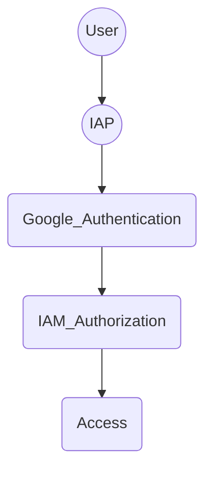
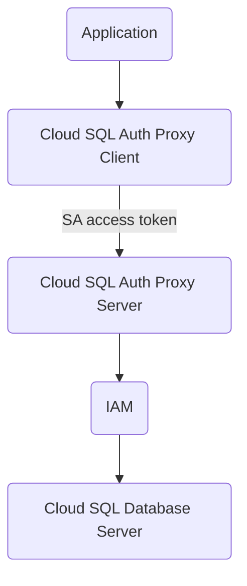

## Section 0: Cloud Computing Fundamentals (GCP)
<details>
    <summary>expand</summary>

> course: Cloud Fundamentals

### Cloud Computing
- On Demand Computing (pool allocation by the provider)
- Self Service
- Access over Internet
- flexible/elastic resources (scalability)
- pay per use only

#### IaaS (Infrastructure as a Service)
- Compute
- Storage
- Network
- pay for allocation

#### PaaS (Platform as a Service)
- more abstraction than IaaS
- JRE, Database, Runtime, Development Stack
- pay for usage

#### SaaS (Software as a Service)
- Service in the Cloud
- consumed by internet users
- e.g. gmail, dropbox etc.

#### Serverless
- Servers/Infrastructure managed by others
- focus on code
- Cloud Functions / Cloud Run

### Google Network
#### Locations
- North America
- South America
- Europe
- Asia
- Australia

#### Regions
- independent geographic area
- e.g. London, Frankfurt etc.
- composed zones (1 region = 3 zones)

#### Zones
- separated spaces in one region
- location where resources are deployed

### Google Infrastructure Security
#### Hardware
- custom designed Hardware and Security Chips
- Secure Boot Stack
- Access Control for Datacenter

#### Services
- Encrypted Communication

#### User
- multi level security controls

#### Internet Communication Layer
- Front End Security
- DoS Protection

#### Operational Security Layer
- Intrusion Detection
- Reducing Insider Risks
- enforces second factor security
- Software Development best practises
- Bug Bounty Program

### Pricing and Billing
- [Online Pricing Calculator](https://cloud.google.com/products/calculator)
- defining Budgets to Account or Project level
- create Alerts for thresholds
- view reports and billing dashboards
- quotas limit erroneous applications to produce unwanted load

#### Quotas
- applied to Project level
- Rate Quotas
    - reset after specific time
    - e.g. 1000 requests/s (reset each second)
- Allocation Quotas
    - set max number of resources for project
    - e.g. max 5 VPC's

### GCP Hierarchy
1. Organization node (root node | overall policies)
2. Folder (assign policies | create hierarchy e.g. business departments)
3. Project (e.g. API, Billing, Collaborators, Google Services)
    - Project ID (globally unique)
    - Project Name (not unique)
    - Project Number (internally used by google)
4. Resources (belongs to one project | e.g. VM, Storage etc.)

### IAM and Authentication
#### IAM - Identity and Access Management
> course: Cloud Fundamentals + Securing and Integrating Components of your Application
- [Overview](https://cloud.google.com/blog/topics/developers-practitioners/cloud-iam-google-cloud)
- Google Account, Google Group, Service Account or Cloud Identity Domain
- Control Permissions by using Roles
- Handling of Authentication and Authorization
- Members can be of type
	- Google Account
	- Service Account (technical user identifier via email)
	- Google Group
	- Google Workspace Domain
	- Cloud Identity Domain
- Grant Access (allow actions) to Resource
- Permission naming: `<service>.<resource>.<verb>`
- Roles are a set of permissions
	- Basic
	- predefined
	- custom
- Client Libraries look for credentials in the environment
- Application Default Credentials (ADC) used to authenticate between applications
- Credentials lookup in the following order:
	- env variable: GOOGLE_APPLICATION_CREDENTIALS
	- check default service account
	- error
- IAM Policies
  - API calls are pre-checked by IAM policies (if they are allowed)
  - IAM policy has a list of policy bindings (always attached to a resource e.g. roles/pubsub.subscriber)
  - policy binding: binds member/identity to a role
  - member can have multiple roles granted
  - member/identity can be a user, group or a service account

#### [Roles](https://cloud.google.com/iam/docs/understanding-roles)
> = collections of permissions
- Basic Role
    - Owner (all permissions)
    - Editor (read/write)
    - Viewer (read only)
    - Billing Admin (read only + billing)
- Predefined Role
    - typical job roles tailored to specific resources
- Custom Role
    - define custom tailored roles
    - only applicable project or organization level

#### OAuth 2.0 Access
- app requests access to resources
- user will be prompted for consent
- if consent provided, app can request credentials from auth server
- app can use credentials to access resources on behalf of the user

#### Identity-Aware Proxy (IAP)
- controls access and verifies user identity
- Applications and Resources can only be accessed via IAP with correct user and IAM role



#### Identity Authentication
- using Identity Plaform API
- add Provider from available Provider (SDK) list
- add authorized domain
- configure users
- configure application via apiKey and authDomain
- authenticate via Client Library

### Service Accounts
- functional/service user
- Permissions defined by IAM Policies

### Interactions with GCP
- Google Cloud Console (GUI)
- Google Cloud SDK and -Shell (gcloud, gsutil, bq)
    - Cloud Shell (online shell via GUI)
- API (programmatic interaction)
- Client Libraries (e.g. python, node, hava, go etc.)
- Cloud Code Plugin for IDE
- Cloud Mobile App (GUI for mobile devices)

</details>

---

## Section 1: GCP Resources
<details>
    <summary>expand</summary>

> course: Cloud Fundamentals + Getting Started With Application Development

### Cloud Source Repositories
- Git in the Cloud

### Cloud Build
- [Overview](https://github.com/priyankavergadia/GCPSketchnote/raw/main/images/CloudBuild.jpg)
- fully managed service for build pipelines
- creates docker image and push to Cloud Container Registry
- build configuration file specifying steps of the pipeline (yaml or json)
- each build step is a docker container
- build status notifications can be published via pubsub

### Cloud Networking
- [Overview](https://cloud.google.com/blog/topics/developers-practitioners/google-cloud-networking-overview)

#### VPC - Virtual Private Cloud
> secure, individual, private cloud-computing model hosted in a public cloud
- segmenting networks
- using firewall rules to restrict access
- combines scalability of public cloud and data isolation of private cloud
- create static routes to forward traffic to specific destinations
- VPC's are global and can have subnets (regional) worldwide
- Routing Tables (forward traffic from/to instances)
- Firewall (restrict access, rules by using tags e.g. `web` = 80,443 IN allow)
- VPC Peering allows connection between VPC's to exchange traffic
- Shared VPC tied to IAM policy
- offers Load balancing

##### Connect VPC to other Networks (e.g. On Premise)
- [Overview](https://cloud.google.com/blog/topics/developers-practitioners/choosing-network-connectivity-option-google-cloud)
- VPN Connection
- Direct Peering over PoP (Points of Presence)
- Carrier Peering (if not already in PoP)
	  - On Premise Network Connection via Service Provider's Network
	  - not covered by Google SLA
- Dedicated Interconnect (direct Connection to Google)
- Partner Interconnect

#### Cloud NAT
- [Overview](https://cloud.google.com/blog/topics/developers-practitioners/cloud-nat-explained)
- provides outgoing connectivity to resources without external IP
- regional resource (per network)

#### Cloud Load Balancing
- [Overview](https://cloud.google.com/blog/topics/developers-practitioners/what-cloud-load-balancing)
- distribute traffic over instances
- managed Service by google
- cross-region load balancing

#### GLB - Global Load Balancer
- handles load balancing across regions (globally)
- Request from the client -> Frontend -> URL Map -> Backend Service -> Cloud Armor -> NEG -> Backend
- handles traffic from the internet
- consists of: frontend, url map and backend service

##### Frontend
- HTTPs Proxy (SSL management via Google or custom) - forwards request to URL Map
- Forwarding rule (bind IP address to HTTPs Proxy)
- can choose static IP address

##### URL Map
- global resource
- provides host- and path-based routing to backend services

##### Backend Services
- contains all the services that handle incoming requests
- global resource
- can be a collection of backends (regional)
- Cloud Storage Buckets are no Backend Service
- Cloud CDN is enabled at the level of a backend service

##### Serverless NEG - Network Endpoint Group
- regional resource
- (adapter) backend type for serverless products

##### Backend
- regional resource
- Service that handles incoming requests (e.g. Cloud Run)

#### Google Cloud Armor
- [Overview](https://raw.githubusercontent.com/priyankavergadia/GCPSketchnote/main/images/CloudArmor.png)
- integrated in GLB
- enabled on the level of a backend service
- filter using policy rules, like:
	- allow/deny IP (range)
	- allow/deny url path
	- allow/deny request method
	- etc.
- preconfigured rules to prevent:
	- XSS (cross-site scripting)
	- SQL injection
	- local/remote file inclusion attacks
	- RCE (remote code execution) attacks

#### Cloud CDN (Content Delivery Network)
- [Overview](https://github.com/priyankavergadia/GCPSketchnote/raw/main/images/CloudCDN.jpg)
- provide end user with content, quickly
  - cacheable (static) content (Edge Caching)
  - low network latency
- enabled on the backend service
- 3 modes
	- cache headers: control caching and expiration via response headers (default)
	- cache all static content: like fonts, images, audio, video etc.
	- cache all: unconditionally caching everything
- benefits:
	- increase content availability
	- improve performance
	- lower costs for backend (handling cached requests)

#### Cloud DNS
- [Overview](https://cloud.google.com/blog/topics/developers-practitioners/cloud-dns-explained)
- managed DNS Service
- low latency, highly availability

---

### Google API Tools
- [Overview](https://cloud.google.com/blog/topics/developers-practitioners/api-management-google-cloud)
- **Cloud Endpoints**
	- Distributed API management system
	- OpenAPI Specification
	- Supports Apps in App Engine, GKE and GCE
- **API Gateway**
	- Secure Access to backend services via REST API
	- Clients consume REST APIs to implement standalone apps
- **Apigee Edge**
	- Focus on Business Functions (rate limiting, quotas, analytics)
	- often B2B
	- Backend Services don't need to be in GCP, often use to take apart legacy apps

#### Cloud Endpoints
- Implement API Gateways using Cloud Endpoints
- API Management (Cloud Endpoint)
	- Interface definition (OpenAPI, gRPC API)
	- Authentication and Authorization (Service- and User Authentication)
	- Logging and monitoring (Cloud Logging, Cloud Trace)
	- Management and Scalability (Service Management / -Control / - Proxy)
- Cloud Endpoints supports REST and gRPC API's
- User Authentication
	- via Firebase, Auth0, Google Authentication or custom Auth
	- after user signed in, auth provider sends signed JWT to Cloud Endpoints
- Server to Server Authentication
	- Google ID Token for signing the Request
- Monitoring of API in Cloud Endpoints Dashboard
- Developer Portal (Cloud Endpoints Portal)

#### API Gateway
- fully managed
- uses gRPC
- inexpensive
- scalable and flexible deployment
- less control than Cloud Endpoints
- Service Proxy required for services outside GCP

#### Apigee API Platform
- API Management Platform for designing, securing and scaling API's
- Proxy API anywhere (not just GCP)
- Legacy apps can be hidden behind API facade
- more expensive
- not appropriate for simple API use cases

---

### Cloud Storage
- [Overview](https://cloud.google.com/blog/topics/developers-practitioners/all-you-need-know-about-cloud-storage)
- Object Storage organized in Buckets
- stored as binary (BLOB)
- immutable
- access via URL's (integrates well with web-technologies)
- Use Cases
	- Website Content
	- Archival & Disaster Recovery
	- Direct Download
- Access Control via IAM Roles
- Lifecycle control
- Storage Types
	- Standard (frequently accessed)
	- Nearline (infrequently access data e.g. once a month)
	- Coldline Storage (low cost of Nearline, access once every 90 days)
	- Archive Storage (lowest cost, access once a year, disaster recovery)
- Object Storage (BLOB)
- HTTP access
- Structure: Projects -> Buckets -> Objects
- Bucket names are global (unique) and publicly visible
- Storage Classes
	- Standard
  - no minimum
  - frequently accessed data
  - low data access costs / high storage cost
	- Nearline
  - minimum: 30 days
  - e.g. moderate accessed data backup
	- Coldline
  - minimum: 90 days
  - e.g. infrequently accessed data
    - Archive
    - minimum: 365 days
    - e.g. disaster recovery
    - high data access costs / low storage costs
- strongly consistent Storage operations
	- read-after-write
	- read-after-delete
	- bucket/object listing
	- granting access
- eventually consistent Storage operations
	- revoking access
	- publicly readable caches objects
- Access
	- Cloud Identity (IAM) - Bucket level access
	- Access Control Lists (ACL) - fined-grained Object level access controls
	- Signed Urls - time limited r/w access
	- Signed Policy Documents - specify what can be uploaded to a bucket
	- Firebase Security Roles - access control for mobile and web apps using Firebase SDK
- Best Practises
	- large objects can be uploaded in chunks (parallel) and combined to a composite object
	- on 429 and 5xx responses, clients should use truncated exponential backoffs for periodically retry
	- CORS permissions can be set on bucket
	- Storage location should be local to consumers
	- use TLS for Transport and use HTTPS library with server certificate validation
	- manage access via groups, not individually
	- Validate Data transferred from/to bucket via CRC32c or MD5 checksum
- offer multi-regional access
- can be accessed from multiregional backend services
- **ideal for** large or rarely accessed data (images and videos) or static website content

### Database Overview
- [which database should I use?](https://cloud.google.com/blog/topics/developers-practitioners/your-google-cloud-database-options-explained)

#### Cloud SQL
- [Overview](https://cloud.google.com/blog/topics/developers-practitioners/what-cloud-sql)
- fully managed relational Databases (e.g. MySQL, Postgres etc.)
- auto patch / backups
- MySQL, PostgreSQL, SQL Server
- **ideal for** structured data

##### Cloud SQL with Cloud Run
- Cloud SQL Auth Proxy Client is managed by Cloud Run
- Handling transactions while Cloud Run scales up:
  - limit max instances of Cloud Run
  - pick the right Cloud SQL instance size
  - use connection pooling
  - always: monitor Cloud SQL instance


#### Cloud Spanner
- [Overview](https://cloud.google.com/blog/topics/developers-practitioners/what-cloud-spanner)
- fully managed, mission-critical relational Database
- scales horizontally
- transactional consistency (strongly consistent)
- "speaks" SQL with joins and secondary indexes
- high availability
- high IO per second
- global scale, high availability (99,999% SLA)
- multi-region replication / offer multi-regional access
- can be accessed from multiregional backend services
- supports interleaf tables (child rows are inserted into the adjacent parent row for faster parent-child join queries)
- **ideal for** high transactions with scale and consistency requirements

#### Cloud Firestore (/ Datastore)
- [Overview](https://cloud.google.com/blog/topics/developers-practitioners/all-you-need-know-about-firestore-cheatsheet)
- managed, serverless
- NoSQL, document oriented (key-value)
- Documents organized into collections
- horizontally scalable
- offer multi-regional access
- can be accessed from multiregional backend services
- Usage: mobile and web apps, web and server development

  Datastore:
- Firestore in Datastore mode
- Native Firestore Features cannot be used with datastore mode
- Usage: Server Applications
- Objects are called "**Entities**"
- Group of Entities are called **Kind**"
- Entities have a unique **key**: unique identifier of (Namespace, Kind, Id, optional:Ancestor Path)
- Values / Fields of Entities are called **Properties**
- Indexes
	- Build in index (for each property)
	- Composite index (combined property index for more complex queries - cause more latency as of consistency)
- For complex queries on large (non indexed) datasets, use BigQuery
- Do not index Properties with monotonically increasing values (such as timestamp)
- Queries are more restrictive that relational databases (like joins)
- Naming based on UTF-8 Characters
- Usage:
	- batch r/w/d operations
	- rollback failed transactions
	- use asynchronous calls
	- use allocateId() method to create Id and avoid hotspots by monotonically increasing numbers

| Features\Mode | Native Mode | Datastore Mode |
| -------- | -------- | -------- |
| mobile and web client libraries | :heavy_check_mark: | :x: |
| real-time and offline features | :heavy_check_mark: | :x: |
| **ideal for** | mobile, web, IoT, real-time applications (no heavy writes) | Server Apps (heavy read/write) |

#### Memorystore (Redis or Memcached)
- [Overview](https://cloud.google.com/blog/topics/developers-practitioners/what-memorystore)
- for caching
- fully managed (like Redis or Memcached)
- requires VPC connector
- VPC connector scale up to access Memorystore
- **ideal for**
	- high performance, scalable web applications
	- gaming
	- stream processing

#### BigQuery
- [Overview](https://cloud.google.com/blog/topics/developers-practitioners/query-big-bigquery-cheat-sheet)
- Enterprise Data Warehouse for analytics
- managed, serverless
- fast response times
- **ideal for** big data processing / reporting (BI)

#### Cloud BigTable
- [Overview](https://cloud.google.com/blog/topics/developers-practitioners/how-big-cloud-bigtable)
- High Performance NoSQL big data database
- handle massive workloads at low latency
- scale billions of rows
- store TB to PB of data
- fast lookup and write speed
- **ideal for** Operational and Analytical Applications ("flat" heavy read/write)
- Use Cases
	- 1TB+ of (semi-)structured data
	- high throughput or rapidly changing data
	- NoSQL data
	- time series or semantic ordering data
	- asynchronous batch or synchronous real-time porocessing
	- machine learning algorithms on data

### [Compute Engine - VM's](https://cloud.google.com/blog/topics/developers-practitioners/where-should-i-run-my-stuff-choosing-google-cloud-compute-option)
- [Overview](https://cloud.google.com/blog/topics/developers-practitioners/what-compute-engine-use-cases-security-pricing-and-more)
- most flexibility
- most operational effort
- billed by second
- automatically applies sustained-use discount
- committed-use discounts
- Preemtible/Spot VM'ss
	- Preemtible VM's up to 24h (e.g. for large compute and batch jobs)
	- Spot VM's no max runtime
- bring your own OS or use predefined (community) images
- `ideal for:` lift-and-shift migrations

> ### Reminder: (not GCP specific)
> ### Containerization
> - Container is a box containing partition, code and dependencies
> - portable Code and OS/Hardware of Host is a black box
> - starts as quickly as a process
> - requires container runtime
> 
> ### Kubernetes
> - Manage and orchestrate containers in a cluster with open source Kubernetes
> - consists of: Control Plane, Nodes, Pods
>   - Kubernetes Cluster contains nodes which contain pods
>   - Pod (smallest unit) = Running Process/App
>   - Service (load balanced pods) - stable Endpoint
> - Automation of: deployment, scaling, load balancing, logging, monitoring
> - Efficiency: Containers are placed based on Compute Nodes their Hardware Requirements
> - Declarative: Explain what the goal state looks like
>   - Declaration by Configuration File (deployment.yml)
> - Self-Healing: Automatically replaces unhealthy or failed containers
- `kubectl` cli

### [Google Kubernetes Engine (GKE)](https://cloud.google.com/blog/topics/developers-practitioners/where-should-i-run-my-stuff-choosing-google-cloud-compute-option)
- [Overview](https://cloud.google.com/blog/topics/developers-practitioners/container-story-google-kubernetes-engine)
- managed Kubernetes Cluster by Google
  - reduces operational effort in comparison to non-managed Kubernetes Cluster
  - low operational costs
- Control Plane (managed by google)
- Worker Nodes (auto-patched by google)
- Pod - Group of Container that shares Network and Storage on the Node (auto-scaled by google)
- User responsibilities:
	- Node provisioning and management
	- security and networking configuration
- `GKE Autopilot` (fully managed kubernetes with even less operational effort)
	- auto provision nodes
	- auto applying security and network best practises
- Hybrid or Multi-Cloud applications possible (e.g. partial On-Premise services)
- allows using non-HTTP protocols

### Hybrid- or Multi-Cloud (Anthos)
- [Overview](https://cloud.google.com/blog/topics/developers-practitioners/what-are-my-hybrid-and-multicloud-deployment-options-anthos)
- Parts of Infrastructure On-Premise and using Cloud Infrastructure
- Anthos = Googles Hybrid- or Multi-Cloud Solution
- Anthos uses Kubernetes and GKE On-Premise

### Cloud App Engine
- [Overview](https://cloud.google.com/blog/topics/developers-practitioners/ultimate-app-engine-cheat-sheet)
- Only write code in self-contained workloads
- fully managed serverless compute engine
- automatically provision servers and rapid scale on demand
- limited Languages and Framework Support
- SDK for local development (local emulation)
- Standard and Flexible environment:
  - Standard (Containers (Java, Python, PHP, Node.js or Ruby), no SSH access)
      - restricted to certain languages
      - for non containerized applications
      - fast scaling up: ideal for spikes in traffic
      - scaling down after 15 minutes of inactivity
      - pay based on computer instanced running
      - no management required
  - Flexible (Custom Configuration (custom Docker Image) (managed Compute Engine VM), SSH access)
      - no restricted languages
      - requires containerized application
      - better for sustained traffic
      - slower scaling up
      - no scale down to zero
  - Cloud Run is the best of both environments

### [Cloud Run](https://cloud.google.com/blog/topics/developers-practitioners/where-should-i-run-my-stuff-choosing-google-cloud-compute-option)
- [Overview](https://cloud.google.com/blog/topics/developers-practitioners/cloud-run-story-serverless-containers)
- Serverless (Infrastructure management is abstracted away: Provisioning, Configuring, Managing) 
- regional service
- automatically provides HTTPS traffic, SSL Certificate, Url Endpoint
- no language/framework/tool restriction
- build on [Knative](https://knative.dev/)
- Autoscaling (scales horizontally depending on traffic)
  - every service has an internal load balancer which provides scaling up and down services based on requests
  - max container instances count per service is limited to 1000
  - max concurrency can be set for configuring scaling conditions
  - if CPU usage is too high, max concurrency will be reduced temporarily
- only charges for use (CPU, Memory, Networking)
- `Write Code` -> `Build Image` -> `Run Image from Artifact Registry (GCR)`
- deploy stateless containers
  - one container per service
  - already built containers
  - Source Code build automatically as a container using Buildpacks
  - container must be in Artifact Registry
  - new versions (deployments) are called revisions
  - new revisions will receive all traffic after deployment (if it is healthy)
  - every service has a unique name and unique https address automatically generated
- revisions can be tagged (will be added as prefix to the unique url) - e.g. git commit id as tag -> tests can be executed against tagged revision first, before deploying to production
- traffic splitting:
	- traffic can be split over revisions
	- user requests can be handled by multiple split revisions (no guarantees of handling by the same revision)
- Container Lifecycle
	- Starting: starts your application (starts container FileSystem, runs entrypoint of the container, probes web endpoint, forward request)
	- Service Requests: serves web requests (only when there are active requests)
	- Idle: not handling web requests (no charging, throttle CPU to nearly zero)
	- Shutting down: stop application gracefully (cannot be controlled by the user - but application can handle SIGTERM signal to gain 10 seconds to stop gracefully e.g. for cleanup)
	- Stopped: Container is stopped
- IAM best practise:
	- default cloud run service account is Editor (Basic role)
	- create service account per cloud run service with the least necessary privilege (reduce exploitation risk)
- `ideal for:` stateless web and event based Applications (Storage, Pubsub, Http)

#### Buildpacks
- Open Source Project
- convert source code into container image without a Dockerfile
- `pack` is a command line tool

### [Cloud Functions](https://cloud.google.com/blog/topics/developers-practitioners/where-should-i-run-my-stuff-choosing-google-cloud-compute-option)
- [Overview](https://cloud.google.com/blog/topics/developers-practitioners/learn-cloud-functions-snap)
- lightweight, event based, asynchronous computing
- restricted to certain languages
- no management of servers or containers
- small, single purpose function
- support: Node.js, Python, Go, Java, .Net, Ruby, PHP
- default timeout 60ec
- Priced based on function time running, request count and provisioned resources
- Use Cases: Small piece of code responding to an event. e.g.:
	- Webhooks (HTTP, Functions)
	- Lightweight ETL (Storage, Functions, Firestore)
	- IoT (PubSub, Functions)
- Invocation
	- Asynchronous (Background Function)
	- Synchronous (HTTP Function)

### Pub/Sub
- [Overview](https://github.com/priyankavergadia/GCPSketchnote/raw/main/images/pubsub.jpg)
- managed messaging architecture for asynchronous (Service to Service) communication
- REST / gRPC / Apache Kafka Connector
- Publisher: creates / publishes messages
  - Publisher(s) publish to topic (n publishers : 1 topic)
  - Publisher does not need to worry about receiver
- Subscriber: receives messages
	- Subscriber(s) subscribe to topic (1 topic : n subscribers)
	- Push OR Pull Method
	- Pull
    - Pub/Sub guarantees the message will be delivered at least once
    - Receiver will send ACK if they received successfully
    - If Receiver exceeds deadline or responds with error HTTP response, message won't be ACK'ed
    - Retry with exponential backoff can be configured
    - Messages will be discarded if delivery fails before maximum retention time
    - Dead-Letter can be configured to store undelivered messages in a dead-letter topic
  - Subscriber controls rate of deliveries
  - allows parallel consumation of messages (higher throuput)
	- Push
  - Subscriber does not need to implement PubSub Client Library (consumes via HTTP POST Endpoint)
  - confirms read message with ACK (message will be deleted fom subscriptions-queue)
- Use Cases
	- topic as a buffer (store messages until downstream subscriber can consume increased amount)
	- multiple subscribers on one topic
- message-ordering can be enabled (increases latency)
- messages can be delivered more than once
	- prevention e.g. via message-ID recording
- `ideal for`: real-time messaging (e.g. click stream data, sensor data etc.)


### Cloud Tasks
- Service to Service communication
- choose Cloud Tasks over Pub/Sub if one of the followings aspects are mandatory:
	- explicit rate controls (useful for external endpoint with certain request rate threshold)
	- longer timouts to respond to a message (> 10 min)
- message-ordering is not available
- no dead-letter functionality

### Machine Learning Intelligence
> course: Securing and Integrating Components of your Application
- GCP offers pre-trained ML models
- available via REST calls
- no ML knowledge required

</details>

---

## Section 2: Build and test an application
<details>
    <summary>expand</summary>

> course: Getting Started With Application Development

### CI (Continuous Integration)
- Changes to the code will be automatically build and tested in a CI-Pipeline
- often combined with CD (Continuous Delivery/Deployment) | _(see Deploy-Section)_
- `Repository` -> `Build (and Test) System` -> `Deployment System` -> `Test/Production Environment`
- SecDevOps = Automate Security Checks in CI/CD

### (Code) Repository Products
- Google Cloud Code
- Github
- Gitlab
- Bitbucket
- etc.

### CI/CD Pipeline Products
- Google Cloud Build
- Github Actions
- Gitlab CI
- Jenkins
- Circle CI
- etc.

</details>

---

## Section 2: Deploy an application
<details>
    <summary>expand</summary>

> course: App Deployment, Debugging, and Performance

### CD - Continuous Delivery
- `Code` -> `Build` -> `Deploy (stage)` -> `Test` -> `Release (production)` -> `Monitor`
	- **Code**: `Google Cloud Source`, `GitHub`, `BitBucket` etc.
	- **Build**: `Google Cloud Build`, `Jenkins`, `GitHub Actions`, `Gitlab CI`, `CircleCI` etc.
	- **Deploy**: `Terraform`, `Ansible`, `Puppet`, `Chef` etc.
	- **Test**: Smoketest, Acceptance tests etc.\
	- **Release**: (same as deploy)
	- **Monitor**: Google Cloud Monitoring

### Deploy Products
- [Terraform](https://www.terraform.io/)
- [Ansible](https://www.ansible.com/)
- [Puppet](https://www.puppet.com/)
- [Chef](https://www.chef.io/)

### Terraform
- Infrastructure as Code (IaC)
- provision GCP resources
- HCL (Hashicorp Configuration Language)
- consistent result (terraform state)
- [Cloud Foundation Toolkit](https://cloud.google.com/foundation-toolkit) provide the best practises and templates: [GCP Terraform Modules](https://cloud.google.com/docs/terraform/blueprints/terraform-blueprints)

### Deployment Target Products
- Compute Engine
- GKE - Google Kubernetes Engine
- Cloud Run
- Cloud Functions
- App Engine

</details>

---

## Section 3: Observability and Operations | Manage Application
<details>
    <summary>expand</summary>

> course: Getting Started With Application Development

### Observability
- [Overview](https://raw.githubusercontent.com/priyankavergadia/GCPSketchnote/main/images/CloudOps.jpg)
- Signals: Metrics, Logs, Trace
- Visualize and Analyze: Dashboards, Metrics/Logs Explorer, Service Monitoring, Health Checks, Profiler
- Incidents: Alerts, Error Reporting, SLO

### Monitoring
> "Collecting, Processing, Aggregating and displaying real-time quantitative data [...]"
> e.g. Query counts, Error counts, Processing times, Server lifetimes
> _Reference_: [Google's Site Reliability Engineering Book](https://landing.google.com/sre/books)

- Foundation of Application Reliability
- Build Dashboards
- Alert on SLO violation
- Metrics/ KPIs
    - Latency (e.g. Page Load, Response Time, Waiting Requests etc.)
    - Traffic (e.g. Requests, IO, Sessions, Transactions etc.)
    - Saturation - how full the service is / capacity of service (e.g. Memory, CPU, Disk etc.)
    - Errors (e.g. 400/500 HTTP Codes, Exceptions, Stack Traces etc.)
- Signal Data -> Aligned Data
- Predefined or Custom Metrics
- Visibility for Performance, Uptime, Overall Health (Uptime / Health checks)
- allow creation of Alerts

### SLI, SLO, SLA
#### SLI (Service Level Indicator)
> Monitoring Metric, measuring one aspect of service's reliability

- Number of good events / Count of all valid events

#### SLO (Service Level Objective)
> Combines SLI with target reliability

- SMART SLO's
- **S**pecific
- **M**easurable
- **A**chievable
- **R**elevant (to the user)
- **T**ime-bound

#### SLA (Service Level Agreement)
> Commitments made to your customers

- minimum level of service
- Alerting Threshhold higher than SLA

#### Logging
- Examine Logs via Google's Log Explorer 
  - System and App Logs
  - Log Search
  - Log based metrics
- logging agent is based on [fluentd](https://www.fluentd.org/)
- near real-time Analyzing
- Export as
	  - Files to GCS (Google Cloud Storage)
	  - Messages to PubSub
	  - Data into BigQuery
- Log Categories
	  - Audit (Admin Activity, Data Access, System Events, Access)
	  - Agent (Fluentd agent - logs from GCE, Containers etc.)
	  - Network (VPC flow, Firewall rules, NAT gateway)
	  - Service (StdOut/StdErr)

#### Error Reporting
- Error notification
- Error dashboard
- Crashes/Exceptions from Services
- Dedicated view for Errors and Stacktrace with navigation to log entry

#### Cloud Trace
- Latency reporting from distributed Applications
- Capture Traces from the Application (trace requests across services)
- Performance insights
- for identifying changes in performance to improve
- automatically collected from applications running on App Engine

#### Cloud Profiler
- Analyzing CPU and Memory consumption from an application
- Analyze Apps across GCP, On-Premise and other clouds
- Support for Java, Go, Python, Node.js
- Call hierarchy and resource consumption in interactive flame graph
- Usage: Install Profiling Agent on the VM where the app runs
- statistical profiler - agent is not always accurate

</details>

---


> Application Development

### Disaster Recovery
- develop and test disaster recovery scenarios regularly
- create recovery plans
- e.g. Scenarios
    - Zonal or Regional Failure
    - Deployment Rollback
    - Connectivity Failure
    - Corrupted Data -> Restore Data from Backup

---

## Section 4: Application Development with Cloud Run

### Controlling Inbound / Outbound traffic
- filter ingress traffic via
	- Google Cloud Armor
	- Ingress proxy
	- IAM

### Ingress Proxy
- handles traffic from internal environment
- 3 modes:
	- INTERNAL: only allows requests from VPC (does not allow requests from e.g. pubsub as those do not run in the VPC)
	- INTERNAL AND LOAD BALANCING: additionally to internal, it allows requests from GLB
	- ALLOW ALL (default): no restrictions

### IAM (Cloud Run)
- 2 use cases:
	- allow specific service accounts only
	- allow unauthenticated (public)
- specific Cloud Run: Cloud Run Invoker
- authenticated request:
	- Request with OIDC (Open ID Connect) token (=JWT token)
	- signed by google

### Serverless VPC Access
- Cloud Run are not part of the VPC -> VPC connector is necessary
- VPC access connector forwards requests between Cloud Run and the VPC
- Control outbound traffic: Configure VPC egress settings
	- route all traffic through VPC connector (even if destination is external)
	- a) restrict outgoing requests via VPC networks firewall rules
	- b) use static outbound IP address instead one from the public pool (e.g. use case use static IP address for firewall allow rules)

### Cloud Workflows
- define worklows in configuration (yaml / json) file
- types
	- assign: sets variables (in memory)
	- call: performs web request and stores response (in memory) - authenticated by IAM
	- switch: decides based on what's in memory and braches to different flows
	- return: returns the in memory result and ends the workflow successfully
	- raise: ends the execution with an error
- can be triggered on a schedule by Cloud Scheduler
- automatically parses json
- predefined connectors are convenient way of accessing cloud services
	- authentication
	- retry build-in
	- etc.
- retry policies can be configured

---
## Section 5: Getting Started with Google Kubernetes Engine

### Kubernetes
- declarative configuration (achieve and maintain desired state with watch loop)
- support of stateless and stateful apps

#### Kubernetes Object Model
- each kubernetes managed item is an object
- contains attributes and state
- can be viewed or edited
- Object spec - desired state
- Object status - current state (provided by Control Plane)
- representation of a 'type' or **kind**

#### Control Plane
- consists of:
  - **kube-ApiServer:**
    - accepts commands for view/change of cluster
  - **kubectl:**
    - connect to kube-ApiServer
    - communicating using the Kubernetes API
    - authenticating
    - managed admission control
  - **etcd:**
    - clusters datbase
    - store state of the cluster
    - cluster configuration / nodes / pods
  - **kube scheduler:**
    - schedule pods onto the nodes
  - **kube controller manager:**
    - continuously monitors cluster for desired state
    - attempt to make changed achieving the desired state
  - **kube cloud manager:**
    - manages controllers that interact with underlying cloud providers

#### Nodes
- each contains a
  - **kublet:** (kubernetes agent)
    - kube-ApiServer connects to kubelet (e.g. start pod)
    - kublet reports back
  - kube-proxy
    - maintain network connectivity among pods

#### Manifest decleration
Pod definition explained:
```yaml
apiVersion: v1 #kubernetes api version  
kind: Pod #object
metadata: # identifier object name, unique id and optional namespace
  name: nginx #unique string per namespace
  	#uid: 4dd... #generated by kubernetes 
  labels: #key value pairs that tag objects
    app: nginx
	env: dev
```

Example Deployment Configuration for 3 nginx pods
```yaml
apiVersion: apps/v1  
kind: Deployment
metadata:
  name: nginx-deployment
  labels:
    app: nginx
spec:
  replicas: 3 #scale
  selector:
    matchLabels:
      app: nginx
    spec:
      containers:
      - name: nginx
        image: nginx:latest
```

#### kubectl
`kubectl` `[command]` `[type]` `[name]` `[flags]`

e.g.:
- kubectl get pods
- kubectl get pod myApp -n flux

---

## Section 6: Hybrid Cloud Modernizing Appplications with Anthos

### Migrate for Anthos and GKE / Migrate to containers
- extract, migrate and modernize applications to deploy to Cloud Run, GKE or Anthos
- automated tool
- extracts application elements of the VM

### StratoZone
- collects data related to machines, performance, capacity, network and utilization
- qualify workloads
- suggest cloud ressources to lift-and-shift

### Fit Assessment Tool
- verifies fitness for containerization
- collects data and generates report to evaluate how much of a 'good fit' a workload is for modernization (Cloud)
- excellent fit / good fit / fit with work before migrating / no fit

### Cloud Run
- consists of:
  - **Service**
    - custom ressource definition
    - knative service
  - **Route**
    - maps service URL to specific revision
    - makes traffic splitting possible
  - **Configuration**
    - desired state
  - **Revisions**
    - Point In Time snapshot of a service
    - stores own autoscaling configuration
- local emulator
  - available in gcloud, intellij etc.
  - `gcloud beta code dev`

### Serving web traffic with custom domains
3 options:
- global: use global external HTTP(s) load balancer (e.g. to use Cloud CDN or Cloud Armor)
- internal: use firebase hosting (plan to stay in google cloud)
- custom: use custom domain mapping (straightforward but limited availability)

### knative Eventing (Event Processing)
- broker: ensures every event find it's way to the consumer
- trigger: used by the broker to decide which consumer gets this event
- uses CloudEvent format

### EventArc
- managed service for knative eventing
- build event driven architectures using EventArc as SaaS solution

---


## Section 1: Designing highly scalable, available, and reliable cloud-native applications

### 1.1 Designing high-performing applications and APIs. Considerations include:
#### Microservices
#### Scaling velocity characteristics/tradeoffs of IaaS (infrastructure as a service), CaaS (container as a service), PaaS (platform as a service), and FaaS (function as a service)
#### Understanding how Google Cloud services are geographically distributed (e.g., latency, regional services, zonal services)
#### User session management
#### Caching solutions
#### HTTP REST versus gRPC (Google Remote Procedure Call)
#### Designing API services with API Gateway and Cloud Endpoints
#### Loosely coupled asynchronous applications (e.g., Apache Kafka, Pub/Sub, Eventarc)
#### Instrumenting code to produce metrics, logs, and traces
#### Graceful shutdown of applications on platform termination
#### Writing fault-tolerant code  

### 1.2 Designing secure applications. Considerations include:
#### Implementing data lifecycle and residency requirements relevant for applicable regulations
#### Security mechanisms that protect services and resources
#### Security mechanisms that secure/scan application binaries and manifests
#### Storing, accessing, and rotating application secrets and keys (e.g., Secret Manager, Cloud Key Management Service)
#### Authenticating to Google Cloud services (e.g., application default credentials, JSON Web Token (JWT), OAuth 2.0)
#### End-user account management and authentication using Identity Platform
#### IAM roles for users, groups, and service accounts
#### Securing service-to-service communications (e.g., service mesh, Kubernetes Network Policies, and Kubernetes namespaces)
#### Running services with least privileged access (e.g., Workload Identity)
#### Certificate-based authentication (e.g., SSL, mTLS)

### 1.3 Managing application data. Considerations include:
#### Defining database schemas for Google-managed databases (e.g., Firestore, Cloud Spanner, Bigtable, Cloud SQL)
#### Defining a data storage key structure for high-write applications
#### Choosing data storage options based on use case considerations, such as:
```
- Time-limited access to objects
- Data retention requirements
- Structured versus unstructured data
- Strong versus eventual consistency
- Data volume
- Data access patterns
- Online transaction processing (OLTP) versus data warehousing
```
##### Time-limited access to objects
##### Data retention requirements
##### Structured versus unstructured data
##### Strong versus eventual consistency
##### Data volume
##### Data access patterns
##### Online transaction processing (OLTP) versus data warehousing

---

## Section 2: Building and testing applications

### 2.1 Setting up your local development environment. Considerations include:

#### Emulating Google Cloud services for local application development
#### Using the Google Cloud Console, Google Cloud SDK, and Cloud Shell tools
#### Using developer tooling (e.g., Cloud Code, Skaffold)

### 2.2 Building. Considerations include:

#### Source control management
#### Creating secure container images from code
#### Developing a continuous integration pipeline using services (e.g., Cloud Build, Artifact Registry) that construct deployment artifacts
#### Code and test build optimization

### 2.3 Testing. Considerations include:

#### Unit testing (e.g., emulators)
#### Integration testing
#### Performance testing
#### Load testing
#### Failure testing/chaos engineering

---

## Section 3: Deploying applications

### 3.1 Adopting appropriate feature rollout strategies. Considerations include:

#### A/B testing
#### Feature flags
#### Backward compatibility

### 3.2 Deploying applications to a serverless computing environment. Considerations include:

#### Sizing and scaling serverless environments
#### Deploying from source code
#### Invocation via triggers
#### Configuring event receivers
#### Exposing and securing application APIs (e.g., API Gateway, Cloud Endpoints)

### 3.3 Deploying applications and services to Google Kubernetes Engine (GKE). Considerations include:

#### Deploying a containerized application to GKE
#### Integrating Kubernetes RBAC with Identity and Access Management (IAM)
#### Configuring Kubernetes namespaces
#### Defining workload specifications (e.g., resource requirements)
#### Building a container image using Cloud Build
#### Configuring application accessibility to user traffic and other services
#### Managing container lifecycle

---

## Section 4: Integrating Google Cloud services

### 4.1 Integrating an application with data and storage services. Considerations include:

#### Managing connections to data stores (e.g., Cloud SQL, Cloud Spanner, Firestore, Bigtable, Cloud Storage)
#### Reading/writing data to/from various data stores
#### Writing an application that publishes/consumes data asynchronously (e.g., from Pub/Sub)

### 4.2 Integrating an application with compute services. Considerations include:

#### Using service discovery (e.g., Service Directory)
#### Reading instance metadata to obtain application configuration
#### Graceful application startup and shutdown

### 4.3 Integrating Cloud APIs with applications. Considerations include:

#### Enabling a Cloud API
#### Making API calls using supported options (e.g., Cloud Client Library, REST API or gRPC, API Explorer) taking into consideration:
```
- Batching requests
- Restricting return data
- Paginating results
- Caching results
- Error handling (e.g., exponential backoff)
```
##### Batching requests
##### Restricting return data
##### Paginating results
##### Caching results
##### Error handling (e.g., exponential backoff)
#### Using service accounts to make Cloud API calls

---

## Section 5: Managing deployed applications

### 5.1 Managing cloud compute services (e.g., Google Kubernetes Engine, serverless). Considerations include:

#### Analyzing lifecycle events
#### Using external metrics and corresponding alerts
#### Configuring workload autoscaling

### 5.2 Troubleshooting applications. Considerations include:

#### Using Debugger
#### Using Cloud Logging
#### Using Cloud Monitoring
#### Using Cloud Profiler
#### Using Cloud Trace
#### Using Error Reporting
#### Using documentation, forums, and Google Cloud support
