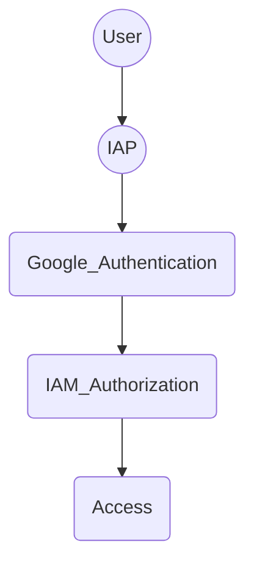

> Learning Path

---

## Section 0: Fundamentals

### Cloud Computing
- On Demand Computing (pool allocation by the provider)
- Self Service
- Access over Internet
- flexible/elastic resources (scalability)
- pay per use only

#### IaaS (Infrastructure as a Service)
- Compute
- Storage
- Network
- pay for allocation

#### PaaS (Platform as a Service)
- more abstraction than IaaS
- JRE, Database, Runtime, Development Stack
- pay for usage

#### SaaS (Software as a Service)
- Service in the Cloud
- consumed by internet users
- e.g. gmail, dropbox etc.

#### Serverless
- Servers/Infrastructure managed by others
- focus on code
- Cloud Functions / Cloud Run

### Google Network

#### Locations
- North America
- South America
- Europe
- Asia
- Australia

#### Regions
- independent geographic area
- e.g. London, Frankfurt etc.
- composed zones (1 region = 3 zones)

#### Zones
- separated spaces in one region
- location where resources are deployed

### Google Infrastructure Security

#### Hardware
- custom designed Hardware and Security Chips
- Secure Boot Stack
- Access Control for Datacenter

#### Services
- Encrypted Communication

#### User
- multi level security controls

#### Internet Communication Layer
- Front End Security
- DoS Protection

#### Operational Security Layer
- Intrusion Detection
- Reducing Insider Risks
- enforces second factor security
- Software Development best practises
- Bug Bounty Program

### Pricing and Billing
- [Online Pricing Calculator](https://cloud.google.com/products/calculator)
- defining Budgets to Account or Project level
- create Alerts for thresholds
- view reports and billing dashboards
- quotas limit erroneous applications to produce unwanted load

#### Quotas
- applied to Project level
- Rate Quotas
    - reset after specific time
    - e.g. 1000 requests/s (reset each second)
- Allocation Quotas
    - set max number of resources for project
    - e.g. max 5 VPC's

---

### GCP Hierarchy
1. Organization node (root node | overall policies)
2. Folder (assign policies | create hierarchy e.g. business departments)
3. Project (e.g. API, Billing, Collaborators, Google Services)
    - Project ID (globally unique)
    - Project Name (not unique)
    - Project Number (internally used by google)
4. Resources (belongs to one project | e.g. VM, Storage etc.)

### IAM - Identity and Access Management
- Google Account, Google Group, Service Account or Cloud Identity Domain
- Controll Permissions by using Roles

#### [Roles](https://cloud.google.com/iam/docs/understanding-roles)
> = collections of permissions
- Basic Role
    - Owner (all permissions)
    - Editor (read/write)
    - Viewer (read only)
    - Billing Admin (read only + billing)
- Predefined Role
    - typical job roles tailored to specific resources
- Custom Role
    - define custom tailored roles
    - only applicable project or organization level

### Service Accounts
- functional/service user
- Permissions defined by IAM Policies

### Interactions with GCP
- Google Cloud Console (GUI)
- Google Cloud SDK and -Shell (gcloud, gsutil, bq)
    - Cloud Shell (online shell via GUI)
- API (programmatic interaction)
- Cloud Mobile App (GUI for mobile devices)

---

### VPC - Virtual Private Cloud
> secure, individual, private cloud-computing model hosted in a public cloud

- combines scalability of public cloud and data isolation of private cloud
- segmenting networks
- using firewall rules to restrict access
- create static routes to forward traffic to specific destinations
- VPC's are global and can have subnets (regional) worldwide
- Routing Tables (forward traffic from/to instances)
- Firewall (restrict access, rules by using tags e.g. `web` = 80,443 IN allow)
- VPC Peering allows connection between VPC's to exchange traffic
- Shared VPC tied to IAM policy
- offers Load balancing

#### Connect VPC to other Networks (e.g. On Premise)
- VPN Connection
- Direct Peering over PoP (Points of Presence)
- Carrier Peering (if not already in PoP)
    - On Premise Network Connection via Service Provider's Network
    - not covered by Google SLA
- Dedicated Interconnect (direct Connection to Google)
- Partner Interconnect

### Compute Engine - VM's
- billed by second
- utomatically applies sustained-use discount
- committed-use discounts
- Preemtible/Spot VM'ss
    - Preemtible VM's up to 24h
    - Spot VM's no max runtime

### Cloud Load Balancing
- distribute traffic over instances
- managed Service by google
- cross-region load balancing

### Cloud DNS
- managed DNS Service
- low latency, highly availability

### Cloud CDN (Content Delivery Network)
- Edge Caching
- low network latency
- provide end user with content, quickly

---
## Section 1: Getting Started With Application Development

### Cloud Storage
- Object Storage organized in Buckets
- stored as binary (BLOB)
- immutable
- access via URL's (integrates well with web-technologies)
- Use Cases
    - Website Content
    - Archival & Disaster Recovery
    - Direct Download
- Access Control via IAM Roles
- Lifecycle control
- Storage Types
    - Standard (frequently accessed)
    - Nearline (infrequently access data e.g. once a month)
    - Coldline Storage (low cost of Nearline, access once every 90 days)
    - Archive Storage (lowest cost, access once a year, disaster recovery)

### Cloud SQL
- fully managed relational Databases (e.g. MySQL, Postgres etc.)
- auto patch / backups

### Cloud Spanner
- fully managed relational Database
- scales horizontally
- strongly consistent
- "speaks" SQL with joins and secondary indexes
- high availability
- high IO per second

### Cloud Firestore
- NoSQL DB
- Documents organized into collections
- horizontally scalable
- Usage: mobile and web apps, web and server development

### Cloud BigTable
- NoSQL big data database
- handle massive workloads at low latency
- Use Cases
    - 1TB+ of (semi-)structured data
    - high throughput or rapidly changing data
    - NoSQL data
    - time series or semantic ordering data
    - asynchronous batch or synchronous real-time porocessing
    - machine learning algorithms on data

---

### Cloud App Engine
- Only write code in self contained workloads
- rapid scaling

### Container
- Box containing partition, code and dependencies
- portable Code and OS/Hardware of Host is a black box
- starts as quickly as a process
- requires container runtime 

### Kubernetes & Google Kubernetes Engine (GKE)
- Manage and orchestrate containers in a cluster
- Scaling, Deploying and Rollbacks
- Kubernetes Cluster contains nodes which contain pods
- Pod (smallest unit) = Running Process/App
- `kubectl` cli
- Service (load balanced pods) - stable Endpoint
- Declaration by Configuration File (deployment.yml)
- GKE = managed Kubernetes Cluster by Google


### Hybrid- or Multi-Cloud (Anthos)
- Parts of Infrastructure On-Premise and using Cloud Infrastructure
- Anthos = Googles Hybrid- or Multi-Cloud Solution
- Anthos uses Kubernetes and GKE On-Premise

---

### App Engine
- Serverless
- automatically provision servers and scale on demand
- limited Languages and Framework Support
- SDK for local development (local emulation)
- Standard Runtime: Containers (Java, Python, PHP, Node.js or Ruby), no SSH access
- Flexible Runtime: Custom Configuration (custom Docker Image) (managed Compute Engine VM), SSH access

### Google API Tools
- Cloud Endpoints
    - Distributed API management system
    - OpenAPI Specification
    - Supports Apps in App Engine, GKE and GCE)
- API Gateway
    - Secure Access to backend services via REST API
    - Clients consume REST APIs to implement standalone apps
- Apigee Edge
    - Focus on Business Functions (rate limiting, quotas, analytics)
    - often B2B
    - Backend Services don't need to be in GCP, often use to take apart legacy apps


### Cloud Run
- Serverless (for stateless containers handling web requests / pubsub events)
- build on Knative
- Autoscaling
- only charges for use
- Write Code -> Build Image -> Run Image from Artifact Registry (GCR)
- auto HTTPS traffic, SSL Certificate, Url Endpoint

---

### Deployment in the Cloud
- Cloud Source Repositories (Git in the Cloud)

### Cloud Functions
- lightweight, event based, asynchronous computing
- small, single purpose function
- support: Node.js, Python, Go, Java, .Net, Ruby, PHP

### Terraform (IaC)
- Describe Template File, Apply to the Environment

---

### Monitoring
> "Collecting, Processing, Aggregating and displaying real-time quantitive data [...]"
> e.g. Query counts, Error counts, Processing times, Server lifetimes
> _Reference_: [Google's Site Reliability Engineering Book](https://landing.google.com/sre/books)

- Foundation of Application Reliability
- Build Dashboards
- Alert on SLO violation
- Metrics/ KPIs
    - Latency (e.g. Page Load, Response Time, Waiting Requests etc.)
    - Traffic (e.g. Requests, IO, Sessions, Transactions etc.)
    - Saturation - how full the service is / capacity of service (e.g. Memory, CPU, Disk etc.)
    - Errors (e.g. 400/500 HTTP Codes, Exceptions, Stack Traces etc.)

### SLI, SLO, SLA

#### SLI (Service Level Indicator)
> Monitoring Metric, measuring one aspect of service's reliability

- Number of good events / Count of all valid events

#### SLO (Service Level Objective)
> Combines SLI with target reliability

- SMART SLO's
- **S**pecific
- **M**easurable
- **A**chievable
- **R**elevant (to the user)
- **T**ime-bound

#### SLA (Service Level Agreement)
> Commitments made to your customers

- minimum level of service
- Alerting Threshhold higher than SLA

### Observability
- Signals: Metrics, Logs, Trace
- Visualize and Analyze: Dashboards, Metrics/Logs Explorer, Service Monitoring, Health Checks, Profiler
- Incidents: Alerts, Error Reporting, SLO

#### Monitoring
- Signal Data -> Aligned Data
- Predifined or Custom Metrics
- Visibility for Performance, Uptime, Overall Health
- allow creation of Alerts

#### Logging
- Examine Logs via Google's Log Explorer 
- near real-time Analyzing
- Export as
    - Files to GCS (Google Cloud Storage)
    - Messages to PubSub
    - Data into BigQuery
- Log Categories
    - Audit (Admin Activity, Data Access, System Events, Access)
    - Agent (Fluentd agent - logs from GCE, Containers etc.)
    - Network (VPC flow, Firewall rules, NAT gateway)
    - Service (StdOut/StdErr)

#### Error Reporting
- Crashes/Exceptions from Services
- Dedicated view for Errors and Stacktraces

#### Cloud Trace
- Latency from distributed Applications
- Capture Traces from the Application
- Performance insights
- Identify Changes in Performance

#### Cloud Profiler
- CPU and Heap Picture of an application
- Analyze Apps across GCP, On-Premise and other clouds
- Support for Java, Go, Python, Node.js
- Call hierarchy and resource consumption in interactive flame graph

---

### Disaster Recovery
- develop and test disaster recovery scenarios regularely
- create recovery plans
- e.g. Scenarios
    - Zonal or Regional Failure
    - Deployment Rollback
    - Connectivity Failure
    - Corrupted Data -> Restore Data from Backup

### CI/CD (Continuous Integration / Continuous Delivery)
- Repository -> Build System -> Deployment System -> Test/Production Environment
- SecDevOps = Automate Security Checks in CI/CD

---

### Interacting with Google APIs
- Command Line Tools (gcloud CLI - like gcloud, gsutil, bq)
- Client Libraries (e.g. python, node, hava, go etc.)
- Cloud Shell - console in the webGUI (tmp VM with gcloud SDK)
- Cloud Code Plugin for IDE 

---

### Storage Options

#### Cloud Storage
- Object Storage (BLOB)
- HTTP access
- **ideal for** large or rarely accessed data (images and videos)
- Structure: Projects -> Buckets -> Objects
- Bucket names are global (unique) and publicly visible
- Storage Classes
	- Standard
		- no minimum
		- frequently accessed data
		- low data access costs / high storage cost
	- Nearline
		- minimum: 30 days
		- e.g. moderate accessed data backup
	- Coldline
		- minimum: 90 days
		- e.g. infrequently accessed data
	- Archive
		- minimum: 365 days
		- e.g. disaster recovery
		- high data access costs / low storage costs
- strongly consistent Storage operations
	- read-after-write
	- read-after-delete
	- bucket/object listing
	- granting access
- eventually consistent Storage operations
	- revoking access
	- publicly readable caches objects
- Access
	- Cloud Identity (IAM) - Bucket level access
	- Access Control Lists (ACL) - fined-grained Object level access controls
	- Signed Urls - time limited r/w access
	- Signed Policy Documents - specify what can be uploaded to a bucket
	- Firebase Security Roles - access control for mobile and web apps using Firebase SDK
- Best Practises
	- large objects can be uploaded in chunks (parallel) and combined to a composite object
	- on 429 and 5xx responses, clients should use truncated exponential backoffs for periodically retry
	- CORS permissions can be set on bucket
	- Storage location should be local to consumers
	- use TLS for Transport and use HTTPS library with server certificate validation
	- manage access via groups, not individually
	- Validate Data transferred from/to bucket via CRC32c or MD5 checksum

#### Firestore (/ Datastore)
- managed, serverless
- NoSQL, document oriented (key-value)
- scalable

| Features\Mode | Native Mode | Datastore Mode |
| -------- | -------- | -------- |
| mobile and web client libraries | :heavy_check_mark: | :x: |
| real-time and offline features | :heavy_check_mark: | :x: |
| **ideal for** | mobile, web, IoT, real-time applications (no heavy writes) | Server Apps (heavy read/write) |

#### Cloud Bigtable
- High Performance NoSQL
- scale billions of rows
- store TB to PB of data
- fast lookup and write speed
- **ideal for** Operational and Analytical Applications ("flat" heavy read/write)

#### Cloud SQL
- relational database service
- MySQL, PostgreSQL, SQL Server
- **ideal for** structured data

#### Cloud Spanner
- mission-critical relational database
- transactional consistency
- global scale, high availability (99,999% SLA)
- multi-region replication
- supports interleaf tables (child rows are inserted into the adjacent parent row for faster parent-child join queries)
- **ideal for** high transactions with scale and consistency requirements

#### BigQuery
- Enterprise Data Warehouse for analytics
- managed, serverless
- fast response times
- **ideal for** big data processing / reporting (BI)

#### Caching
- Memorystore (Redis or Memcached)
- ideal for
    - high performance, scalable web applications
    - gaming
    - stream processing

### Cloud Datastore
- Firestore in Datastore mode
- Native Firestore Features cannot be used with datastore mode
- Usage: Server Applications
- Objects are called "**Entities**"
- Group of Entities are called **Kind**"
- Entities have a unique **key**: unique identifier of (Namespace, Kind, Id, optional:Ancestor Path)
- Values / Fields of Entities are called **Properties**
- Indexes
	- Build in index (for each property)
	- Composite index (combined property index for more complex queries - cause more latency as of consistency)
- For complex queries on large (non indexed) datasets, use BigQuery
- Do not index Properties with monotonically increasing values (such as timestamp)
- Queries are more restrictive that relational databases (like joins)
- Naming based on UTF-8 Characters
- Usage:
	- batch r/w/d operations
	- rollback failed transactions
	- use asynchronous calls
	- use allocateId() method to create Id and avoid hotspots by monotonically increasing numbers

---
## Section 2: Securing and Integrating Components of your Application

### Identity and Access Management (IAM)
- Handling of Authentication and Authorization
- Members can be of type
	- Google Account
	- Service Account (technical user identifier via email)
	- Google Group
	- Google Workspace Domain
	- Cloud Identity Domain
- Grant Access (allow actions) to Resource
- Permission naming: `<service>.<resource>.<verb>`
- Roles are a set of permissions
	- Basic
	- predefined
	- custom
- Client Libraries look for credentials in the environment
- Application Default Credentials (ADC) used to authenticate between applications
- Credentials lookup in the following order:
	- env variable: GOOGLE_APPLICATION_CREDENTIALS
	- check default service account
	- error

#### OAuth 2.0 Access
- app requests access to resources
- user will be prompted for consent
- if consent provided, app can request credentials from auth server
- app can use credentials to access resources on behalf of the user

#### Identity-Aware Proxy (IAP)
- controls access and verifies user identity
- Applications and Resources can only be accessed via IAP with correct user and IAM role



#### Identity Authentication
- using Identity Plaform API
- add Provider from available Provider (SDK) list
- add authorized domain
- configure users
- configure application via apiKey and authDomain
- authenticate via Client Library

---

### PubSub
- managed messaging architecture for asynchronous communication
- REST / gRPC / Apache Kafka Connector
- ideal for: real-time messaging (e.g. click stream data, sensor data etc.)
- Publisher: creates messages
- Subscriber: receives messages
	- Push OR Pull Method
		- Pull
			- Subscriber controls rate of deliveries
			- allows parallel consumation of messages (higher throuput)
		- Push
			- Subscriber does not need to implement PubSub Client Library (consumes via HTTP Endpoint)
	- confirms read message with ACK (message will be deleted fom subscriptions-queue)
- Use Cases
	- topic as a buffer (store messages until downstream subscriber can consume increased amount)
	- multiple subscribers on one topic

---

### Machine Learning Intelligence
- GCP offers pre-trained ML models
- available via REST calls
- no ML knowledge required

---

###  Cloud Functions
> overall description see above
- default timeout 60sec
- Use Cases:
	- Webhooks (HTTP, Functions)
	- Lightweight ETL (Storage, Functions, Firestore)
	- IoT (PubSub, Functions)
- Invocation
	- Asynchronous (Background Function)
	- Synchronous (HTTP Function)

---

### Managing API's

#### Cloud Endpoints
- Implement API Gateways using Cloud Endpoints
- API Management (Cloud Endpoint)
	- Interface definition (OpenAPI, gRPC API)
	- Authentication and Authorization (Service- and User Authentication)
	- Logging and monitoring (Cloud Logging, Cloud Trace)
	- Management and Scalability (Service Management / -Control / - Proxy)
- Cloud Endpoints supports REST and gRPC API's
- User Authentication
	- via Firebase, Auth0, Google Authentication or custom Auth
	- after user signed in, auth provider sends signed JWT to Cloud Endpoints
- Server to Server Authentication
	- Google ID Token for signing the Request
- Monitoring of API in Cloud Endpoints Dashboard
- Developer Portal (Cloud Endpoints Portal)

#### API Gateway
- fully managed
- uses gRPC
- inexpensive
- scalable and flexible deployment
- less control than Cloud Endpoints
- Service Proxy required for services outside GCP

#### Apigee API Platform
- API Management Platform for designing, securing and scaling API's
- Proxt API anywhere (not just GCP)
- Legacy apps can be hidden behind API facade
- more expensive
- not appropriate for simple API use cases

---
## Section 3: App Deployment, Debugging, and Performance


---

## Section 1: Designing highly scalable, available, and reliable cloud-native applications

### 1.1 Designing high-performing applications and APIs. Considerations include:
#### Microservices


#### Scaling velocity characteristics/tradeoffs of IaaS (infrastructure as a service), CaaS (container as a service), PaaS (platform as a service), and FaaS (function as a service)
#### Understanding how Google Cloud services are geographically distributed (e.g., latency, regional services, zonal services)
#### User session management
#### Caching solutions
#### HTTP REST versus gRPC (Google Remote Procedure Call)
#### Designing API services with API Gateway and Cloud Endpoints
#### Loosely coupled asynchronous applications (e.g., Apache Kafka, Pub/Sub, Eventarc)
#### Instrumenting code to produce metrics, logs, and traces
#### Graceful shutdown of applications on platform termination
#### Writing fault-tolerant code  

### 1.2 Designing secure applications. Considerations include:

#### Implementing data lifecycle and residency requirements relevant for applicable regulations
#### Security mechanisms that protect services and resources
#### Security mechanisms that secure/scan application binaries and manifests
#### Storing, accessing, and rotating application secrets and keys (e.g., Secret Manager, Cloud Key Management Service)
#### Authenticating to Google Cloud services (e.g., application default credentials, JSON Web Token (JWT), OAuth 2.0)
#### End-user account management and authentication using Identity Platform
#### IAM roles for users, groups, and service accounts
#### Securing service-to-service communications (e.g., service mesh, Kubernetes Network Policies, and Kubernetes namespaces)
#### Running services with least privileged access (e.g., Workload Identity)
#### Certificate-based authentication (e.g., SSL, mTLS)

### 1.3 Managing application data. Considerations include:

#### Defining database schemas for Google-managed databases (e.g., Firestore, Cloud Spanner, Bigtable, Cloud SQL)
#### Defining a data storage key structure for high-write applications
#### Choosing data storage options based on use case considerations, such as:
```
- Time-limited access to objects
- Data retention requirements
- Structured versus unstructured data
- Strong versus eventual consistency
- Data volume
- Data access patterns
- Online transaction processing (OLTP) versus data warehousing
```
##### Time-limited access to objects
##### Data retention requirements
##### Structured versus unstructured data
##### Strong versus eventual consistency
##### Data volume
##### Data access patterns
##### Online transaction processing (OLTP) versus data warehousing

---

## Section 2: Building and testing applications

### 2.1 Setting up your local development environment. Considerations include:

#### Emulating Google Cloud services for local application development
#### Using the Google Cloud Console, Google Cloud SDK, and Cloud Shell tools
#### Using developer tooling (e.g., Cloud Code, Skaffold)

### 2.2 Building. Considerations include:

#### Source control management
#### Creating secure container images from code
#### Developing a continuous integration pipeline using services (e.g., Cloud Build, Artifact Registry) that construct deployment artifacts
#### Code and test build optimization

### 2.3 Testing. Considerations include:

#### Unit testing (e.g., emulators)
#### Integration testing
#### Performance testing
#### Load testing
#### Failure testing/chaos engineering

---

## Section 3: Deploying applications

### 3.1 Adopting appropriate feature rollout strategies. Considerations include:

#### A/B testing
#### Feature flags
#### Backward compatibility

### 3.2 Deploying applications to a serverless computing environment. Considerations include:

#### Sizing and scaling serverless environments
#### Deploying from source code
#### Invocation via triggers
#### Configuring event receivers
#### Exposing and securing application APIs (e.g., API Gateway, Cloud Endpoints)

### 3.3 Deploying applications and services to Google Kubernetes Engine (GKE). Considerations include:

#### Deploying a containerized application to GKE
#### Integrating Kubernetes RBAC with Identity and Access Management (IAM)
#### Configuring Kubernetes namespaces
#### Defining workload specifications (e.g., resource requirements)
#### Building a container image using Cloud Build
#### Configuring application accessibility to user traffic and other services
#### Managing container lifecycle

---

## Section 4: Integrating Google Cloud services

### 4.1 Integrating an application with data and storage services. Considerations include:

#### Managing connections to data stores (e.g., Cloud SQL, Cloud Spanner, Firestore, Bigtable, Cloud Storage)
#### Reading/writing data to/from various data stores
#### Writing an application that publishes/consumes data asynchronously (e.g., from Pub/Sub)

### 4.2 Integrating an application with compute services. Considerations include:

#### Using service discovery (e.g., Service Directory)
#### Reading instance metadata to obtain application configuration
#### Graceful application startup and shutdown

### 4.3 Integrating Cloud APIs with applications. Considerations include:

#### Enabling a Cloud API
#### Making API calls using supported options (e.g., Cloud Client Library, REST API or gRPC, API Explorer) taking into consideration:
```
- Batching requests
- Restricting return data
- Paginating results
- Caching results
- Error handling (e.g., exponential backoff)
```
##### Batching requests
##### Restricting return data
##### Paginating results
##### Caching results
##### Error handling (e.g., exponential backoff)
#### Using service accounts to make Cloud API calls

---

## Section 5: Managing deployed applications

### 5.1 Managing cloud compute services (e.g., Google Kubernetes Engine, serverless). Considerations include:

#### Analyzing lifecycle events
#### Using external metrics and corresponding alerts
#### Configuring workload autoscaling

### 5.2 Troubleshooting applications. Considerations include:

#### Using Debugger
#### Using Cloud Logging
#### Using Cloud Monitoring
#### Using Cloud Profiler
#### Using Cloud Trace
#### Using Error Reporting
#### Using documentation, forums, and Google Cloud support
